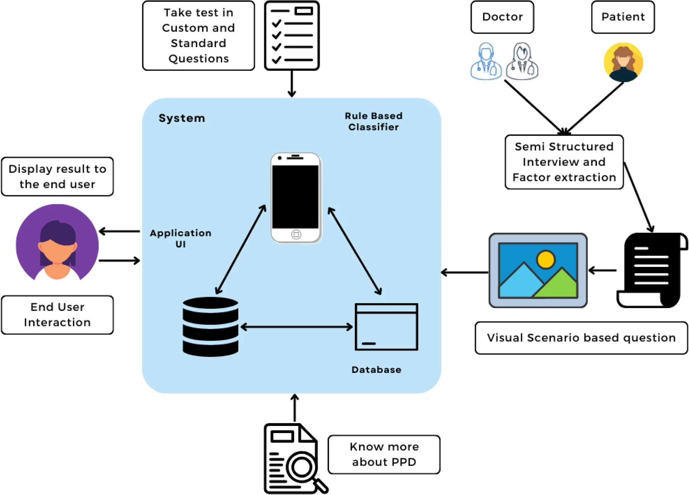

# 📱 PPD Screening Application

## Figure 1. System Architecture

  

  <em>
  Overview of the system architecture illustrating user interaction, rule-based classification, database integration, and visual scenario-based question generation for postpartum depression screening.
  </em>

---

## Figure 2. Standard Questionnaire Interface

  
  

  <em>
  (a) Standard questionnaire interface with text-based questions and answer options &nbsp;&nbsp;&nbsp;&nbsp;
  (b) Score display showing risk level, score range, and user options for submission and retake
  </em>

---

## Figure 3. Story-based Interaction Interface

  
  

  <em>
  (a) Story-based visual question interface with contextual illustrations and localized language &nbsp;&nbsp;&nbsp;&nbsp;
  (b) Score visualization with risk interpretation and user interaction options
  </em>

---

## Figure 4. Application Entry and Test Options

  
  

  <em>
  (a) Entry screen providing test and informational options &nbsp;&nbsp;&nbsp;&nbsp;
  (b) Selection interface for custom and standardized (EPDS) testing modes
  </em>

---

## 🧠 Description

This application provides an accessible and user-friendly platform for early screening of postpartum depression (PPD). It combines:

- Standard questionnaire-based screening (EPDS)
- Story-based and visual interaction for improved engagement
- Rule-based classification for risk assessment
- Multilingual support for broader accessibility

The system is designed to enhance usability and interpretability, especially for users with varying literacy levels, while providing meaningful mental health insights.
